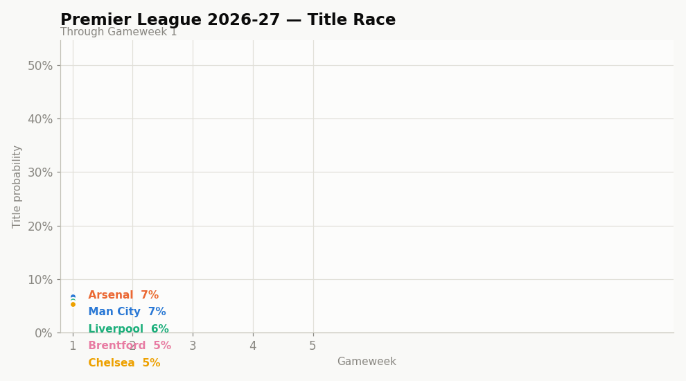

# Premier League Title Prediction

An LSTM model that estimates each club's probability of winning the Premier League
title, updated week-by-week through the season. Outputs are **Kalshi-style
percentages** — one probability per team per gameweek, softmaxed across the 20 clubs
so they always sum to 100%.



> The GIF above regenerates every gameweek. An interactive version (crosshair
> tooltips, per-team table, dark mode) is built at `outputs/dashboard.html`.

---

## How It Works

### Data
Match results are downloaded from **[football-data.co.uk](https://www.football-data.co.uk/)**
— free, no API key, every PL season from 1993-94 onwards. From the raw fixtures the
pipeline derives two things:

- **`data/historical_matches.csv`** — one row per fixture (the Elo engine's input)
- **`data/historical_standings.csv`** — one row per team per game played (points,
  goals, form, live position after every game)

### Features
Each row is a team's state after their Nth game of the season.

**Absolute** — `position`, `form` (last-5 as W=3/D=1/L=0), `won`/`draw`/`lost`,
`points`, `goalsFor`/`goalsAgainst`/`goalDifference`, `games_remaining`.

**Relative** — `points_per_game`, `points_gap_from_leader` (0 for the leader,
negative otherwise), `max_obtainable_points` (`points + games_remaining × 3`, the
title ceiling).

**Pre-season priors** — the signals that make gameweek-1 odds realistic before any
results exist:
- **`prev_position`** — the team's final league position last season (promoted /
  previously-absent teams get 21). A clean prior for *every* team, not just
  champions.
- **`elo`** — a results-based strength rating that also carries a **squad market
  value** seed (both below).

### Elo — results-based, with prestige seeding
The Elo is a proper chained rating updated after **every match** across all history,
like [clubelo](http://clubelo.com/) / FiveThirtyEight:

```
expected_home = 1 / (1 + 10^((elo_away − (elo_home + home_adv)) / 400))
delta         = K × goal_diff_multiplier × (result − expected_home)
elo_home += delta ;  elo_away −= delta
```

Because it only ever sees match results, it is **completely competition-agnostic** —
a team is never penalised for playing in more competitions.

The context you *do* want — squad market value, European pedigree and trophies — is
folded in **additively** at the start of each season, on top of the mean-reverted
carryover:

```
season_start_elo = 1500 + 0.75 × (prev_end_elo − 1500)      # mean reversion
                 + value_bonus(this_season)                 # squad market value (below)
                 + european_qualification_bonus(prev_finish) # >0 even with no trophies
                 + trophy_bonus(prev_season)                 # stacks per trophy
```

- **Squad-value bonus** — see the dedicated section below.
- **European qualification bonus** rewards finishing high enough to reach Europe on
  its own: CL (~top 5) `+40`, EL (~6th) `+25`, ECL (~7th) `+15`.
- **Trophy bonus** stacks per trophy won: PL `+50`, CL `+50`, EL `+30`, FA `+20`,
  League Cup `+15`, ECL `+15`.

Every term is additive, so being in more competitions — or winning more of them —
can only ever *raise* a team's Elo. All constants live at the top of
[`src/prem_prediction/elo.py`](src/prem_prediction/elo.py) for tuning.

### Squad market value — the pre-season prior that makes GW1 realistic
Total squad market value is the single strongest predictor of where a club finishes,
and it captures what a league table cannot: transfer spending and the raw quality gap
between the elite and everyone else. Prediction markets move on exactly this
information, so feeding it to the model makes pre-gameweek-1 odds far more realistic —
without it, every team starts a season clustered near 5% (a 20:1 field), which is
nonsense.

Values are scraped from **Transfermarkt** (`squad_value.py` → `data/squad_values.csv`,
2005-present) and folded into the Elo seed as:

```
value_bonus = 80 × z          where z = within-season z-score of log(squad value)
```

Two deliberate choices:
- **Relative, not absolute.** Using the z-score *within each season* makes it immune
  to decades of transfer-fee inflation — a 2008 squad and a 2026 squad are scored on
  the same relative scale, against their own peers.
- **The log** tames the heavy right tail (a handful of super-clubs) so the spread is
  roughly symmetric. Top squads land ~`+150` Elo, the cheapest ~`−140`.

Seasons before ~2005 (no data) get `0`, so Elo stays defined for all history while
training still benefits from the modern, value-aware seasons.

**Effect on GW1 odds** (2026-27, favourites): before squad value the field was almost
flat (Arsenal 7%, Brentford 5.4%); after, it reads like a real book — Arsenal ~33%
(3:1), Man City ~29% (3:1), Brentford out at ~26:1, promoted sides ~0%.

> **Why this replaced the old formula.** The previous "elo" divided trophies won by
> the number of competitions entered. Reaching Europe raised that denominator, so a
> side strong enough to qualify got a *lower* prior than an identical non-European
> trophy winner — it punished teams for being in more competitions. It also
> multiplied by `100 / current_position`, which just duplicated the `position`
> feature. Both problems are gone.

### Model
A two-layer LSTM with masking and dropout:

```
Masking → LSTM(64) → Dropout(0.3) → LSTM(32) → Dropout(0.3) → Dense(1)
```

The output is a **raw logit** (no sigmoid). At prediction time the 20 teams' logits
are collected and passed through **softmax together**, so the model learns a 20-way
ranking (only one team can win) rather than 20 independent binaries. Trained with
`BinaryCrossentropy(from_logits=True)`.

**Partial-sequence training:** sequences are cut at gameweeks 1, 2, 3, 5, 10, … 38
and zero-padded, so the model makes confident calls at every stage. The early cutoffs
(1-3) are what teach it to lean on the pre-season priors — without them a GW1 sequence
is out-of-distribution and the model falls back to a near-uniform guess no prior can
pierce.

---

## Project Layout

```
src/prem_prediction/     # the package
  data_acquisition.py    #   download fixtures, build standings
  elo.py                 #   results-based Elo + squad-value / prestige seeding
  squad_value.py         #   Transfermarkt squad-value scraper
  trophy_data.py         #   historical trophy winners + bonus values
  prepare_model_data.py  #   form, labels, relative features, prev_position, Elo merge
  model_train.py         #   LSTM training
  season_predict.py      #   current-season Kalshi predictions → predictions.json
  evaluate.py            #   grouped-season CV of the title ranking
  viz.py                 #   title_race.gif + dashboard.html
  build_dataset.py       #   full historical rebuild
  add_season.py          #   append a finished season
  update.py              #   gameweek refresh (predict + viz)
  config.py / paths.py   #   season detection, filesystem paths
scripts/update.py        # thin wrapper: python scripts/update.py
data/                    # matches, standings, out.csv, squad_values.csv
models/                  # best_model.h5, scaler.joblib
outputs/                 # predictions.json, title_race.gif, dashboard.html, evaluation.json
```

The current season is detected automatically from the date (`config.current_season_start_year`),
so nothing is hard-coded to a particular year.

---

## Setup

```bash
pip install -r requirements.txt
pip install -e .          # makes `python -m prem_prediction.*` work
```

## Running the Pipeline

```bash
# 1. Scrape squad market values (Transfermarkt, 2005 → current season)
python -m prem_prediction.squad_value

# 2. Build the training dataset (downloads 1993-94 → latest completed season)
python -m prem_prediction.build_dataset

# 3. Train the model
python -m prem_prediction.model_train

# 4. Predict the current season + build the graph/dashboard
python -m prem_prediction.update
```

`update` is the one you re-run each gameweek: it pulls the latest results, re-scores
every completed gameweek, and rebuilds `outputs/title_race.gif` and
`outputs/dashboard.html`. It does **not** retrain — that only happens once a season,
after it completes.

## Adding a Finished Season

When a season ends, append it and retrain:

```bash
python -m prem_prediction.add_season --season 2025 \
    --pl Arsenal --fa "Man City" --lc "Man City" \
    --cl None --el "Aston Villa" --ecl "Crystal Palace"
python -m prem_prediction.model_train
```

Team names must match the football-data.co.uk convention exactly
(`"Man City"`, `"Nott'm Forest"`, …).

## Evaluation

`val_loss` during training is per-team sigmoid BCE on a leaky random split — not the
metric we ship. `evaluate.py` scores the actual product (the softmax title ranking) on
**held-out whole seasons** (grouped k-fold, no sequence leaks), against a trivial
"current league leader wins" baseline:

```bash
python -m prem_prediction.evaluate            # 5-fold, writes outputs/evaluation.json
```

Held-out results (33 seasons; `champ prob` = probability mass on the eventual champion;
uniform guess = 5%):

| GW | model top-1 | leader top-1 | champ log-loss | champ prob |
|---:|---:|---:|---:|---:|
| 1 | **0.21** | 0.09 | 1.83 | **19.1%** |
| 19 | **0.64** | 0.58 | 1.06 | 53.5% |
| 30 | 0.82 | 0.79 | 0.54 | 72.4% |
| 38 | 0.90 | 1.00 | 0.30 | 78.5% |

The model does its real work **early**, where a market has value: at GW1 it puts 19%
on the eventual champion (vs 5% uniform) and ranks them first more than twice as often
as reading the table. Mid-to-late it edges then ties the trivial baseline — the ceiling
of the problem, since once ~25 games are played "who's top" is already near-perfect.

## Automated Weekly Refresh

A scheduled cloud agent can run the refresh for you every week and push the updated
graph to the repo. It needs GitHub connected to your Claude account
(`/web-setup` or https://claude.ai/connect-github) and the code pushed to `main`.

---

## Configuration Notes

- `constants.py` is gone. The legacy football-data.org API key (only used by the
  optional `FootballDataAPI` wrapper) is now read from the `FOOTBALL_DATA_API_KEY`
  environment variable — see `.env.example`. The main pipeline needs no key.
